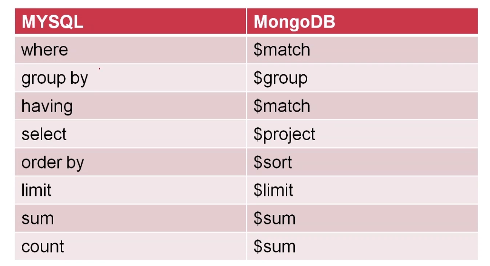
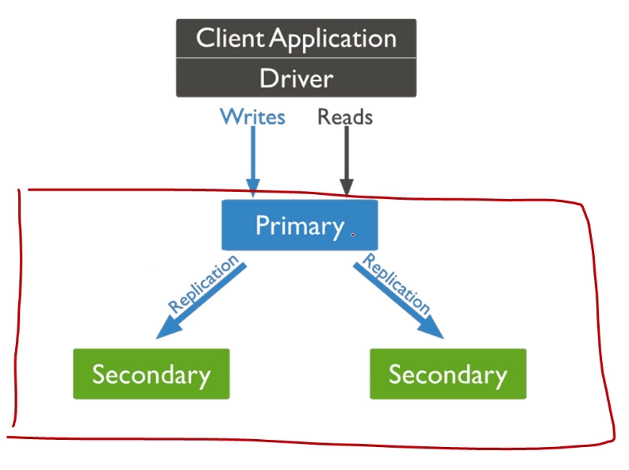

MongoDb
===

### 核心特征
- 文档数据库(schema free),基于二进制JSON存储文档
- 高性能,高可用,直接加机器即可解决扩展性问题
- 支持丰富年CURD操作,例如:聚合统计,全文检索,坐标检索

#### 文档数据库:schema free
```
{
    name:"sue",
    age:26,
    status:"A",
    groups:["news","sports"]
}
```

### 用法示例:选择database
- 数据库
    - 列举数据库: `show database`
    - 选择数据库: `use my_db`
    - 结论:数据库无需创建,只是一个命名空间
- 表
    - 列举数据表: `show collections`
    - 建立数据表: `db.createCollection("my_collection")`
    - 结论:时间表schema free,无需定义字段
- 插入
    - `db.my_collection.insertOne({uid:10000,name:"dollarkiller",likes:["golang","bilibili"]})`
    - 结论1:任意嵌套层级的BSON(二进制的JSON)
    - 结论2:文档ID是自动生成的,通常无需自己指定
- 查询
    - `db.my_collection.find({likes:'golang',name:{$in:['dollarkiller','es']}}).sort({uid:1})` sort({uid:1})正序
    - 结论1:可以基于任意BSON层基过滤
    - 结论2:支持功能与Mysql相当
- 更新 
    - `db.my_collection.updateMany({likes:'golang'},{$set:{name:'dollarkiller'}})`
    - 结论1:参数一为过滤条件
    - 结论2:参数二为更新操作
- 删除
    - `db.my_collection.deleteMany({name:'dollarkiller'})`
    - 结论:参数为过滤条件
- 创建index
    - `db.my_collection.createIndex({uid:1,name:-1})` 
    - 结论:可以指定建立索引的正反顺序
- 集合类比

    - 输入
    ``` 
    db.my_collection.aggregate([
        {$unwind:'$likes'},
        {$group:{
            {id:
                {likes:'$likes'},
                {$project:{
                    _id:0,
                    like:"$_id.likes",
                    total:{$sum:1}
                }}
            }
        }}
    ])
    ```
    - 输出
    ```
    {'like':'game','total':1}
    {'like':'football','total':1}
    ```
    - 结论:pipline流式计算,功能复杂

### 原理介绍

####  整体存储架构
- Mongod: 单机版数据库
- Replica Set: 复制集,由多个Mongod组成的高可用存储单位 
- Sharding:分布式集群,由多个Replica Set组成可扩展集群

- Mongod

    - 默认采用WiredTiger高性能存储引擎
    - 基于journaling log宕机恢复(类比mysql的redo log)
- Replica Set架构

    - 至少3个节点组成,其中1个可以只充当arbiter
    - 主从基于oplog复制同步(类比mysql binlog)
    - 客户端默认读写primary节点
- Sharding结构
    