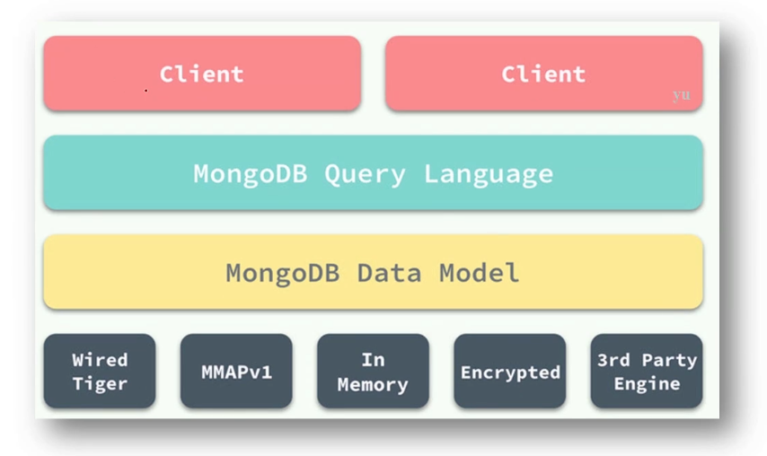

MongoDb
===

### 核心特征
- 文档数据库(schema free),基于二进制JSON存储文档
- 高性能,高可用,直接加机器即可解决扩展性问题
- 支持丰富年CURD操作,例如:聚合统计,全文检索,坐标检索

#### 文档数据库:schema free
```
{
    name:"sue",
    age:26,
    status:"A",
    groups:["news","sports"]
}
```

### 用法示例:选择database
- 数据库
    - 列举数据库: `show database`
    - 选择数据库: `use my_db`
    - 结论:数据库无需创建,只是一个命名空间
- 表
    - 列举数据表: `show collections`
    - 建立数据表: `db.createCollection("my_collection")`
    - 结论:时间表schema free,无需定义字段
- 插入
    - `db.my_collection.insertOne({uid:10000,name:"dollarkiller",likes:["golang","bilibili"]})`
    - 结论1:任意嵌套层级的BSON(二进制的JSON)
    - 结论2:文档ID是自动生成的,通常无需自己指定
- 查询
    - `db.my_collection.find({likes:'golang',name:{$in:['dollarkiller','es']}}).sort({uid:1})` sort({uid:1})正序
    - 结论1:可以基于任意BSON层基过滤
    - 结论2:支持功能与Mysql相当
- 更新 
    - `db.my_collection.updateMany({likes:'golang'},{$set:{name:'dollarkiller'}})`
    - 结论1:参数一为过滤条件
    - 结论2:参数二为更新操作
- 删除
    - `db.my_collection.deleteMany({name:'dollarkiller'})`
    - 结论:参数为过滤条件
- 创建index
    - `db.my_collection.createIndex({uid:1,name:-1})` 
    - 结论:可以指定建立索引的正反顺序
- 集合类比

    - 输入
    ``` 
    db.my_collection.aggregate([
        {$unwind:'$likes'},
        {$group:{
            {id:
                {likes:'$likes'},
                {$project:{
                    _id:0,
                    like:"$_id.likes",
                    total:{$sum:1}
                }}
            }
        }}
    ])
    ```
    - 输出
    ```
    {'like':'game','total':1}
    {'like':'football','total':1}
    ```
    - 结论:pipline流式计算,功能复杂

### 原理介绍

####  整体存储架构
- Mongod: 单机版数据库
- Replica Set: 复制集,由多个Mongod组成的高可用存储单位 
- Sharding:分布式集群,由多个Replica Set组成可扩展集群

- Mongod

    - 默认采用WiredTiger高性能存储引擎
    - 基于journaling log宕机恢复(类比mysql的redo log)
- Replica Set架构

    - 至少3个节点组成,其中1个可以只充当arbiter
    - 主从基于oplog复制同步(类比mysql binlog)
    - 客户端默认读写primary节点
- Sharding结构

    - mongos作为代理,路由请求到特定的shard
    - 3个mongd节点组成config server,保存数据元信息
    - 每个shard是一个replica set,可以无限扩容
- Collection分片

    - collection自动分裂成多个chunk
    - 每个chunk被自动负载均衡到不同的shard
    - 每个shard可以保证其上的chunk高可用
- 按range拆分chunk

    - shard key可以是单索引字段或者联合索引字段
    - 超过16MB的chunk被一分为二
    - 一个collection的所有chunk首尾相连,构成整个表
- 按hash拆分chunk

    - shard key必须是hash索引
    - shard key经过hash函数打散,避免写热点
    - 支持预分配chunk,避免运行时分裂影响写入
- shard用法
    - 为DB激活特性:`sh.enableSharding('my_db')`
    - 配置hash分片:`sh.shardCollection("my_db.my_collection",{
    _id:"hashed"},false,{numlnitialChunks:10240})`
    
``` 
mongo 
> show databases;
> use my_db // 创建数据库
> db.createCollection("my_collection") // 创建表
{ "ok" : 1 }
> show collections;
my_collection
> db.my_collection.insertOne({uid:100,name:"dollarkiller"})
{
	"acknowledged" : true,
	"insertedId" : ObjectId("5cf9cbd50b9be5a8212e79fd")
}
> db.my_collection.find() // 不带条件都返回
{ "_id" : ObjectId("5cf9cbd50b9be5a8212e79fd"), "uid" : 100, "name" : "dollarkiller" }
> db.my_collection.find({uid:1000})
> db.my_collection.find({uid:100})
{ "_id" : ObjectId("5cf9cbd50b9be5a8212e79fd"), "uid" : 100, "name" : "dollarkiller" }
> db.my_collection.createIndex({uid:1})  // 创建索引
{
	"createdCollectionAutomatically" : false,
	"numIndexesBefore" : 1,
	"numIndexesAfter" : 2,
	"ok" : 1
}

```

### golang 操作mongo
依赖包
``` 
vgo get github.com/mongodb/mongo-go-driver
```
- init
``` 
var (
	Mongo *mongo.Client
	MongoDb *mongo.Database
	e error
)

func init()  {
	timeout, _ := context.WithTimeout(context.Background(), 5*time.Second)
	Mongo, e = mongo.Connect(timeout, options.Client().ApplyURI("mongodb://127.0.0.1:27017"))
	MongoDb = Mongo.Database("cron")
}
```
- 插入 
```
// 任务执行的时间点
type TimePoint struct {
	StartTime int64 `bson:"startTime"`// 开始时间
	EndTime int64 `bson:"endTime"`// 结束时间
}

// 一条日志
type LogRecord struct {
	JobName string `bson:"jobName"` // 任务名称
	Command string `bson:"command"`// shell命令
	Err string `bson:"err"`// 脚本错误
	Content string `bson:"content"`// 脚本输出
	TimePoint TimePoint `bson:"timePoint"`// 执行时间
}

func main() {
	logCollection := mongo.MongoDb.Collection("log")

	// 插入记录
	record := &LogRecord{
		JobName:"job1",
		Command:"echo hello",
		Err:"",
		Content:"hello",
		TimePoint:TimePoint{
			StartTime:time.Now().Unix(),
			EndTime:time.Now().Unix()+10,
		},
	}

	result, e := logCollection.InsertOne(context.TODO(), record)
	if e != nil {
		panic(e.Error())
	}
	// _id:默认生成一个全局唯一id:object id:12字节的二进制
	if ids,ok := result.InsertedID.(primitive.ObjectID);ok{
		fmt.Println(ids)
	}else{
		fmt.Println("no")
	}
}
```