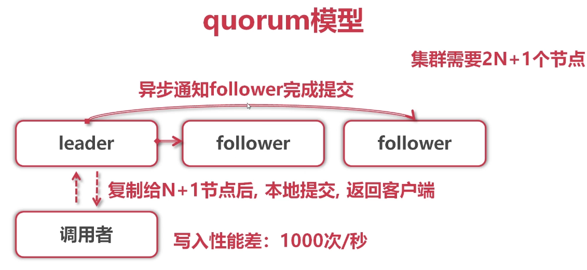
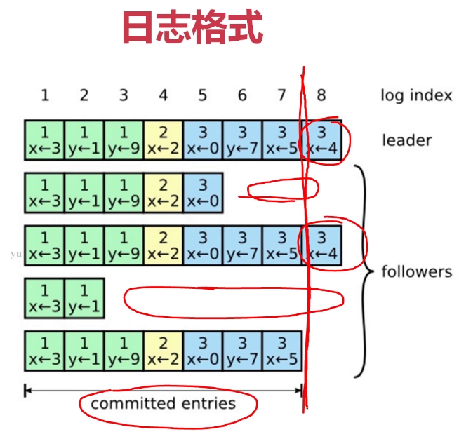
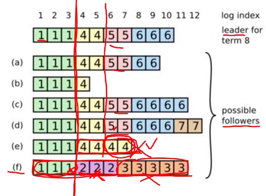
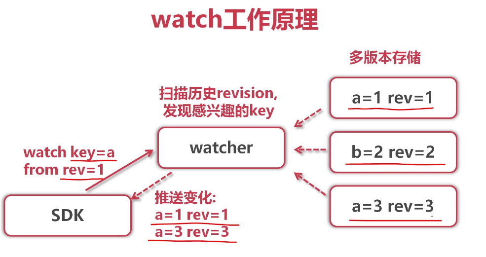
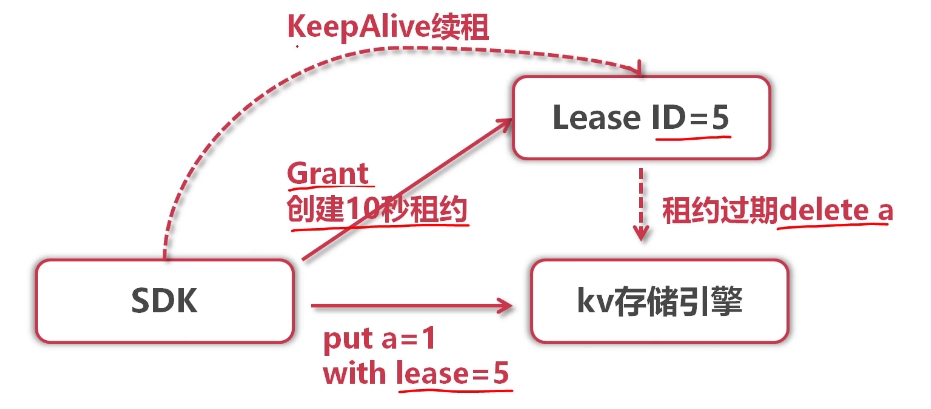

# GO-Distributed-Task-Scheduling
Golang 分布式任务调度

- master-worker 分布式架构设计
- etcd协调服务
    - CAP理论
    - Raft协议
    - 服务注册与发现
    - 任务分发
    - 分布式锁
- 多任务调度
- 事件广播
- mongodb分布式储存
- 异步日志
- 并发设计
- systemctl服务管理
- nginx负载均衡


### 知识铺垫
- shell执行
- cron表达式
- etcd协调服务
- mongodb分布式存储

### 实战
- 分布式crontab架构
- 实现master
- 实现worker
- 完善系统

### 开发环境
- 开发环境： ubuntu 18.4
- 开发语言： Golang 1.12.5
- 开发工具： Goland IDE 2019.1
- 依赖存储： mongodb + etcd (docker images latest)
- 部署环境： centos7 (docker images latest)

### 执行shell命令

涉及的系统调用
```
pipe(): 创建2个文集描述符,fd[0]可读,fd[1]可写
fork(): 创建子进程,fd[1]被继承到子进程
dup2(): 重定向子进程stdout/stderr到fd[1]
exec(): 在当前进程内,加载并执行二进制程序
```
通过Command类执行任务
- 定义在os/exec包
- 封装年上述底层细节
```
func main() {
	// 生成cmd
	command := exec.Command("/bin/bash", "-c", "sleep 5;ls -l")

	// 执行命令,捕获了子进程的输出(pipe)
	bytes, e := command.CombinedOutput()
	if e != nil {
		panic(e.Error())
	}

	fmt.Println((string(bytes)))
}
```
- 超时杀死任务
``` 
type rest struct {
	output []byte
	err error
}

var (
	outch = make(chan *rest)
)


func main() {
	ctx, cancel := context.WithCancel(context.TODO())
	// 在一个协程里,执行一个cmd 让他执行2s
	go func(ctx context.Context) {
		commandContext := exec.CommandContext(ctx, "/bin/bash", "-c", "sleep 2;echo hello;")
		bytes, e := commandContext.CombinedOutput()

		outch <- &rest{output:bytes,err:e}
	}(ctx)
	// 1s的是否,我们杀死cmd
	time.Sleep(time.Second)
	cancel()
	i := <-outch
	if i.err != nil {
		fmt.Println(i.err.Error())
	}else {
		fmt.Println(string(i.output))
	}
}
```

### Cron表达式
- *分(0-59)  *时(0-23) *日(1-31) *月(1-12) *星期(0-7)
- 常见用法
    - 每个5分钟执行一次: */5 * * * * echo hello > /tmp/x.log
    - 第1-5分钟执行5次: 1-5 * * * * /usr/bin/python/data/x.py
    - 每天10点,22点执行一次: 0 12,22 * * * echo bye | tail -1
    
#### Cron调度原理
- 小例子
    - 已知当前UNIX时间为1559547054,2019/6/3 15:30:54
    - 当前Cron表达式为30 * * * *
    - 如何计算命令的下次调度时间?
- 计算逻辑
    - 当前时间: 2019/6/3 15:30:54
#### 开源Cronexpr库
- Parse(): 解析与校验Cron表达式
- Next(): 根据当前时间,计算下次调度时间
单调度
``` 
func main() {
	// 解析cron表达式
	expression, e := cronexpr.Parse("*/5 * * * * * *")// 秒 分 时 日 月 周 年
	if e != nil {
		panic(e.Error())
	}
	now := time.Now()
	// 下一次调度时间
	next := expression.Next(now)

	// 等待定时器超时
	time.AfterFunc(next.Sub(now), func() {
		fmt.Println(next.Sub(now))
		fmt.Println("被调度了",next)
	})
	time.Sleep(10 * time.Second)
}
```
多调度
``` 
func main() {
	// 需要一个调度协程,它定时检查所有的Cron任务,谁过期就执行谁
	cron := cronexpr.MustParse("*/5 * * * * * *")
	nextTime := cron.Next(time.Now())
	jobs := make(map[string]*CronJob)
	jobs["job1"] = &CronJob{cron:cron,tim:nextTime}

	cron = cronexpr.MustParse("*/1 * * * * * *")
	nextTime = cron.Next(time.Now())
	jobs["job2"] = &CronJob{cron:cron,tim:nextTime}

	go func() {
		for {
			select {
			case <- time.NewTimer(300 * time.Millisecond).C:
				now := time.Now()
				for k,v := range jobs {
					go func(k string,v *CronJob) {
						if v.tim.Before(now) || v.tim.Equal(now) {
							fmt.Println("执行任务",k)
						}
						v.tim = v.cron.Next(now)
					}(k,v)
				}
			}
		}
	}()

	time.Sleep(10 * time.Second)
}
```

### etcd 协调服务
- 功能介绍 CAP CP强一致性
    - 将数据存储到集群中高可用K-V存储
    - 允许应实时监听存储分钟的k-V变化
    - 能够容忍单点故障,能够应对网络分区
- 原理
    - 抽屉理论
        - 一个班级60人
        - 有一个秘密告诉给班里31人
        - 那末随便挑选31人,一定有一个人知道秘密
    - etcd 与 raft关系
        - raft是强一致性集群日志同步算法
        - etcd是一个分布式kv存储
        - etcd利用raft算法在集群中同步kv
    - quorum模型
        - 集群需要2N + 1个ie节点
        
    - 日志格式
        
    - Raft 日志概念
        - replication: 日志在leader生成,向follower复制,达到各个节点的日志序列最终一致性
        - term: 任期,重新选取产生的leader,其term单调递增
        - log index: 日志行在日志序列的下标
    - Raft 异常场景
        
    - Raft 异常安全
        - 选举leader需要半数以上节点参与
        - 节点commit日志最多的允许选举为leader
        - commit日志同样多,则term,index越大的允许选举为leader
    - Raft保证
        - 提交成功的请求,一定不会丢
        - 各个节点的数据将最终一致
    - 交互协议
        - 通用的HTTP+JSON协议,性能低效
        - SDK内置GRPC协议,性能高效
    - 重要特征
        - 底层存储是按key有序排列的,可以顺序遍历
        - 因为key有序,所有etcd天然支持按目录结构高效遍历
        - 支持复杂事任,提供类似if ...then ... else ...的事务能力
        - 基于租约机制实现key的TTL过期
    - key有序存储
        - /config/database
        - /feature-flags/verbost-logging
        - /feature-flags/redesign
        > 获取子目录内容,只需要seek到不大于.feature-flags/的第一个key开始先后SCAN即可
    - MVCC多版本控制
        - Put /key1 value 1 -> revision = 1
        - Put /key2 value 2 -> revision = 2
        - Put /key1 value 3 -> revision = 3
        > 提交版本(revision)在etcd中单调递增
        > 同key维护历史版本,实现watch机制
        > 历史版本过多,可以通过执行compact命令完成删减
    - 监听kv变换
        - 通过watch机制,可以监听某个key,或者某个目录(key前缀)的连续变化
        - 常用于分布式系统的配置分发,状态同步
        
    - lease 租约
        
    


