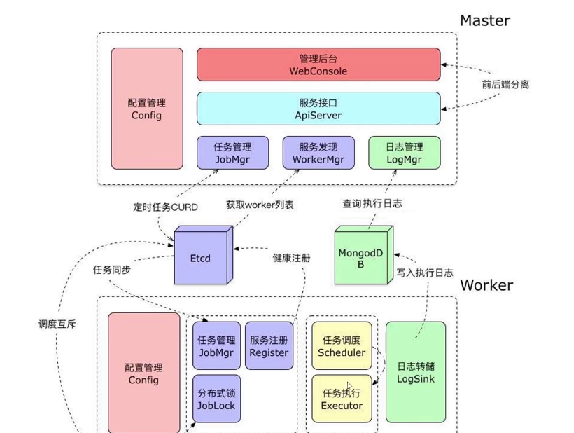
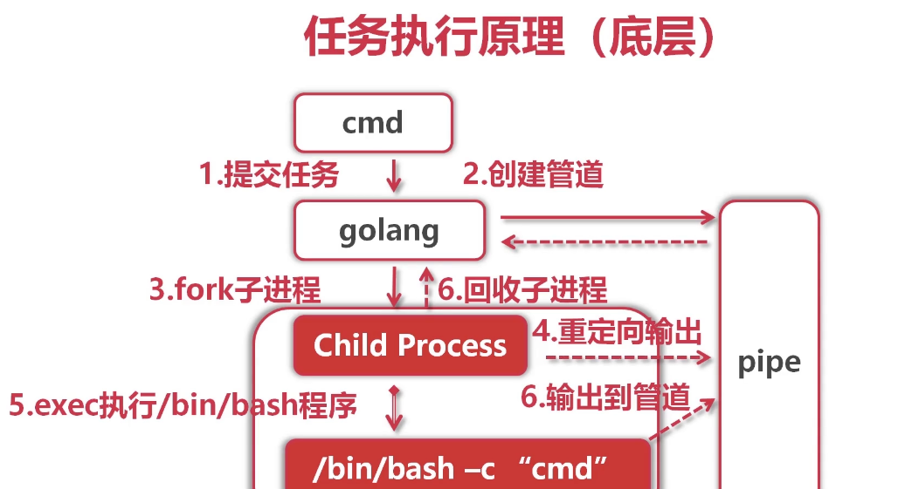

# GO-Distributed-Task-Scheduling
Golang 分布式任务调度

- master-worker 分布式架构设计
- etcd协调服务
    - CAP理论
    - Raft协议
    - 服务注册与发现
    - 任务分发
    - 分布式锁
- 多任务调度
- 事件广播
- mongodb分布式储存
- 异步日志
- 并发设计
- systemctl服务管理
- nginx负载均衡



### 知识铺垫
- shell执行
- cron表达式
- etcd协调服务
- mongodb分布式存储

### 实战
- 分布式crontab架构
- 实现master
- 实现worker
- 完善系统

### 开发环境
- 开发环境： ubuntu 18.4
- 开发语言： Golang 1.12.5
- 开发工具： Goland IDE 2019.1
- 依赖存储： mongodb + etcd (docker images latest)
- 部署环境： centos7 (docker images latest)

### 执行shell命令

涉及的系统调用
```
pipe(): 创建2个文集描述符,fd[0]可读,fd[1]可写
fork(): 创建子进程,fd[1]被继承到子进程
dup2(): 重定向子进程stdout/stderr到fd[1]

```

